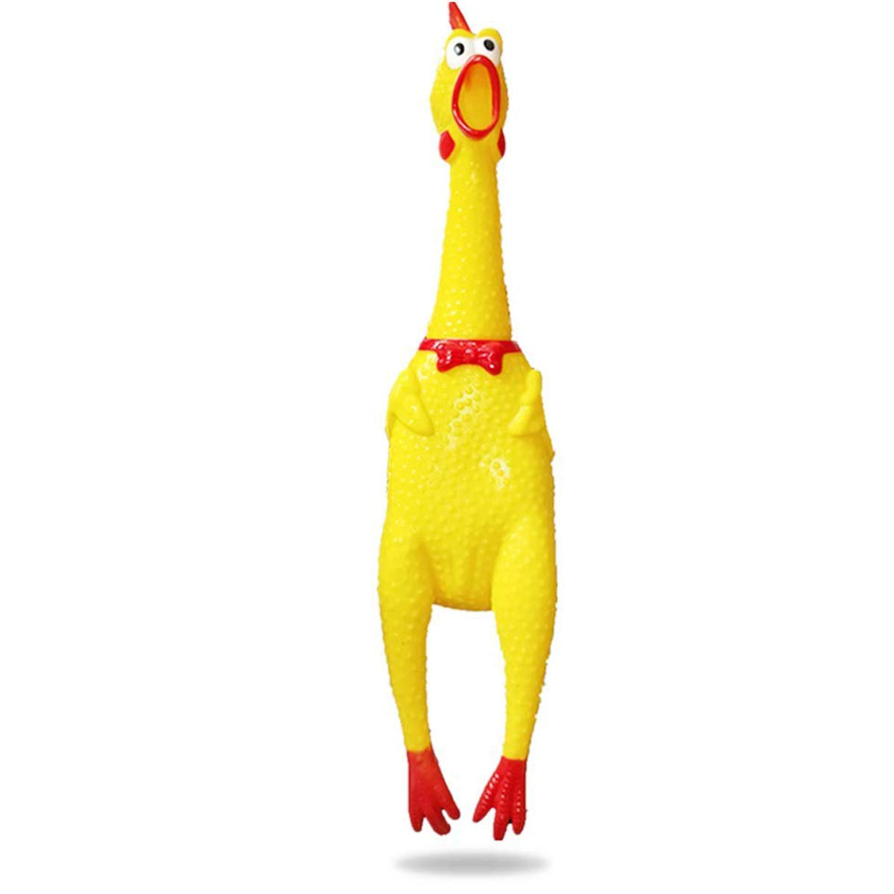

# fake-business

## Fake Business Website Tutorial
Greetings business owner! This manual will walk you through the steps to create a website for your business using HTML and CSS!

## Table of Contents
- [Introduction](#introduction)
- [Prerequisites](#prerequisites)
- [Project Structure](#project-structure)
- [Step-by-Step Guide](#step-by-step-guide)
  - [1. Brainstorm!](#1-brainstorm)
  - [2. Download the project!](#-2-download-the-project)
  - [3. Steps listed](#3-steps-listed)
- [Extra stuff!](#extra-stuff)
- [Things to Look Out For](#things-to-look-out-for)
- [Conclusion](#conclusion)

## Introduction
In this manual, you will learn more about HTML, CSS -- including **flexbox** -- with the use of making your own business website!

Here's a simple example of the result, there are some extra stuff you can do if you are fast!


## Prerequisites
Before you start, here's a review of CSS Flexbox -- skip if you already know!
- Imagine there is a big box -- let's call it `bigBox` -- and inside, it contains the following: `box1`, `box2`, and `box3`.
  - `bigBox` is the **parent element**.
  - `box1`, `box2`, and `box3` are the **child elements**.
- **Why this is important:** The main idea of this is just elements inside of elements, which is what you'll see a lot of in this manual.

## Project Structure
Here's how the project is structured.
```plaintext
fake-business/
├── index.html
├── thankyou-page.html
└── style.css
The following files you can just leave as is: README.md & image-examples.
```

## Step-by-Step Guide

### 1. Brainstorm!
Before programming your website, think of the following:
- Name of business
- What are you selling?

If you want to, draw out or imagine what your website would look like.

### 2. Download the project!
Once you have a general idea of what you want for our website, download the project files.
- The code will have comments -- looks like this `<!-- Hi, this is a comment -->` -- which will contain steps.

### 3. Steps listed
- **1. )  Link the CSS!**
  - Remember it's `<link rel="__________" href="_____.___">`
  - What are you trying to connect?
    - If you answered **stylesheet**, you are correct!
  - What's the name of the file that you're trying to connect?
    - If you answered **style.css** you are correct! However, the file name can be anything **as long as it ends with .css and it matches.**
      - Here's an example! `<link rel="stylesheet" href="style.css">`
  - Once you link it, refresh the page and you'll see something different!

- **2. )  What do you want to name your business as?**
  - Find the following line of code, `<title> Name me! </title>`
      - **Hint: the title tag is usually located in `<head>`!**

- **3. )  Change your header!**
  - Find the following line of code, `<h1 id="header-name"> Name me! </h1>`
      - **Hint: Look in `<body>`!**
  - Enter your business name!
  - If you want to change the color of the header, go to your stylesheet and find `#header-container`.

- **4. ) Change the logo!**
    - Go to your stylesheet and find `#logo-container`.
    - From there you should see `background-image: url('image-examples/Logo-example.png');`
        - You can change what's inside of `url()`.
        - Find an image online and copy it's image link!
            - Right click on the photo and find **Copy Image Link**
        - Paste the link in `url()`
            - It should look like this: `background-image: url("put-your-link-here.com");`
            - Don't worry if the link is long, it's usually long.
        - If this doesn't work:
            - Download the image
            - Put it in the project folder
            - Change `background-image` to this `background-image: url('name-of-the-image-file.png');`
                - Note: it doesn't have to be .png, it can also be .gif, .jpeg, etc...

- **5. )  Add your own item!**
    - Find `<div class="item-container">` and change the following:
        - item-name: What do you want to name this item as?
        - item-price: How much does this item cost?
        - image of item: There are two ways to do this.
            - 1. ) Copy image link of the image you found and put it in ``
            - **OR**
            - 2. ) Download the image and put it in the project folder then put the image file name
                 - It should be something like this: ``
                     - Remember that the file extenstion `.png` can be .jpeg, .gif, etc...

- **6. ) Repeat!**
    - Congrats, you made one item! Now you can make as much by copying and pasting
    - ```
      <div class="item-container">
          <div class="item-img">
              
          </div>
          <div class="item-descriptor">
              <div class="item-name">
                  Rubber Chicken
              </div>
              <div class="item-price">$5.00</div>
          </div>
      </div>
    - Repeat step 5 for this!

## Extra stuff!
Nice job! You completed the basic outline, here are some extra stuff you can do if you want!
- 1. ) Add a buy button!
     - Add the following code below `<div class="item-price"> </div>`
         - `<button class="buy-button" onclick="buyPage()"> Buy Now </button>`
         - If you have multiple items in your shop, make sure to add it to the other items too!
         - Here's an example of what `<div class="item-container">` looks like after you added the button!
             - ```
               <div class="item-container">
                    <div class="item-img">
                        
                    </div>
                    <div class="item-descriptor">
                        <div class="item-name">
                            Rubber Chicken
                        </div>
                        <div class="item-price">$5.00</div>
                        <button class="buy-button" onclick="buyPage()"> Buy Now </button>
                    </div>
                </div>
            - Notice how `<button>` has `onclick="buyPage()"`?
                - This uses JavaScript -- you'll learn this later -- which makes your website more interactive.
                - Here's the following code:
                    - ```
                      <script>
                          function buyPage() {
                              window.location.assign("thankyou-page.html");
                          }
                      </script>
                    - Add this to the bottom of the body.
                      - It should be something like this:
                        - ```
                          <body>
                            ...
                            <script>
                              function buyPage() {
                                  window.location.assign("thankyou-page.html");
                              }
                            </script>
                          </body>
                    - Notice how `window.location.assign();` contains a html page? You can find that file and change how it looks.
            - Refresh the page to see the changes
                - If you want to change how the button looks, go to your stylesheet and find `.buy-button`.

## Conclusion

Congratulations! You've created a simple website using HTML, CSS, and JavaScript. This is just the beginning – there are many more features and technologies to explore. Keep learning and experimenting to build more complex and dynamic websites.

Feel free to reach out if you have any questions or feedback. Happy coding!
